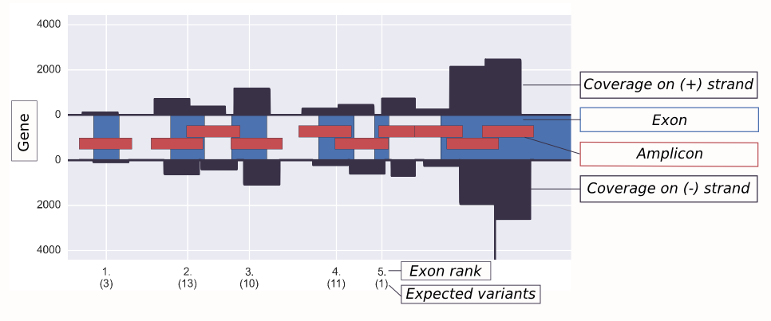
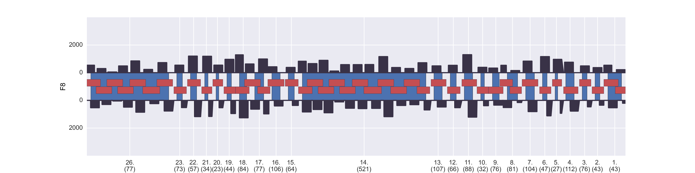

#CoverageCheck

##Introduction

This script was mainly written for end users in a clinical diagnostics setting. The use case is routine panel sequencing of patients on Illumina MiSeq/HiSeq or Lifetech PGM/Proton. It is crucial to distinguish between 

A) high-confidence positions with a reference allele and

B) low-confidence positions where a variant call is impossible.

Without coverage information, A) and B) would look the same on a clinical report: "no variants found". For clinical decision making though, it's quite a difference if a patient is wildtype on TP53 or if we can't make a statement about TP53.

High-confidence positions are defined as having a coverage above the minimum accepted coverage (default 50X) and a ratio of coverage on minus vs plus strand (default 5x)
below the maximum accepted strand ratio.

#####################################################################################
##Output

For each sample, CoverageCheck creates a results folder with the following output files:

###Plots

Illustration of the raw coverage plots. Exon sizes are to scale, while introns have been shrunken to allow fitting everything into one plot.

This plot shows the raw coverage for the complete F8 gene. Overall exon coverage is uniform and very good. It's easy to see how the amplicons have been designed to overlap each other and cover all exons.

This plot shows the mean coverage per exon. An X instead of a bar indicates that the panel doesn't include amplicons for this exon, so no coverage would be expected. Exons are simply plotted next to each other regardless of their real distance on the chromosome.

###Tables
1. **[samplename]_failed_regions_coverage.tsv**

    A list of bases that fail the coverage cutoff. Continous streches of bases are summarized as a region. 

2. **[samplename]_failed_regions_strandbias.tsv**

    A list of bases that fail the strandbias cutoff. Continous streches of bases are summarized as a region. 

If a list of expected variants is provided, two additional output files are produced:

3. **[samplename]_expected_variant_coverage.tsv**

    A list of all variant position in the original vcf, with columns added for coverage, strandbias and whether the position passes the cutoffs.

4. **[samplename]_expected_variant_coverage_per_gene.tsv**

    A list of all genes that contain at least one expected variant. For each gene, the total expected variants, the variants that have sufficient quality to be         theoretically discoverable and the ratio fo discoverable to total is listed.

#####################################################################################
##Usage

A GUI is started via a Desktop icon or directly from the command line

> *"python CoverageCheck_GUI_tkinter.py".*

CoverageCheck can also be started directly from the command line:

> CoverageCheck.py [-h] -b BED [-x EXPECTED_VARIANTS] [-a ALIAS]
>                        [-w WHITELIST] [-c MIN_COVERAGE] [-s MAX_STRANDRATIO]

#####################################################################################
##Input

CoverageCheck assumes that all input files are located in the same folder.
The minimum accepted coverage and the maximum accepted strand ratio are set in the GUI.

#### Required
- **location of the bam folder**

- **region file** (Bed format or Illumina Manifest)

CoverageCheck parses the gene names from amplicon names of type 'SMAD4_Exon_(2023461)_2777650' (as is the standard for Illumina custom panels).

#### Optional
- **expected variants** (vcf format or export format of HGMD mutation mart)
Specifiying this will lead to the creation of additional output files listing the 'theoretical discoverability' for each variant for the given cutoff values. Expected variants per exon will also be listed in the plots.

- **gene alias file** (txt file, one gene per row, format: old_name new_name)
This option is a simple hack to deal with amplicons that have gene names that differ from the offical names listed in the HumanExons_V75(...) file.  

- **allowed bams file** (txt file, one bam per row)
This option allows to analyze not all bams in the target folder by explicitly specifiying the bams to be analyzed. 

#####################################################################################
##Fixed input

CoverageCheck expects a bed file of exon locations. By default, this is the file HumanExons_Ensembl_v75_refseqs.bed, but any other list of input exons can be defined.

To recreate HumanExons_Ensembl_v75_refseqs.bed, execute these steps:

1. Go to http://www.ensembl.org/biomart/
2. Download a file that links Ensembl IDs with RefSeq IDs ("refseq.csv")

    Format: 
    > EnsemblGeneID EnsemblTranscriptID RefSeqmRNA

2. Download a second file that contains information on exons ("exons.csv")

    Format: 
    > EnsemblGeneID EnsemblTranscriptID ExonChrStart ExonChrEnd ConstitutiveExon ExonRankinTranscript ChromosomeName AssociatedGeneName Strand

3. Run create_refseq_bed_from_2_biomart_tables.py on the 2 files to create a bed file using the transcripts with the oldest RefSeqIDs per gene:

    Usage:
    > python create_refseq_bed_from_2_biomart_tables.py refseq.csv exons.csv > HumanExons_Ensembl_v75_refseqs.bed

#####################################################################################
##Installation on Windows/OSX

CoverageCheck only supports installation on Linux. However, it can be run on other operating systems using a ready-to-use Virtual Machine Image
for VirtualBox hosted on the John Radcliffe Hospitals Molecular Diagnostics Department: http://www.oxford-translational-molecular-diagnostics.org.uk/
See **virtual_machine_installation_readme.txt** in this repository for installation instructions.

#####################################################################################
##Dependencies

CoverageCheck expects a Linux system with Python 2.7 and bedtools (2.17.0+) installed. The following Python packages are expected as well: numpy (1.8.1+), pandas (0.13.1+), matplotlib (1.3.1+) and seaborn (0.3+).

The bam files need to be indexed (i.e. have a '\*.bam.bai' file in the same folder). If missing, this can be created with "samtools index sample.bam"

#####################################################################################
##Licence

Released under a BSD (3-clause) license
